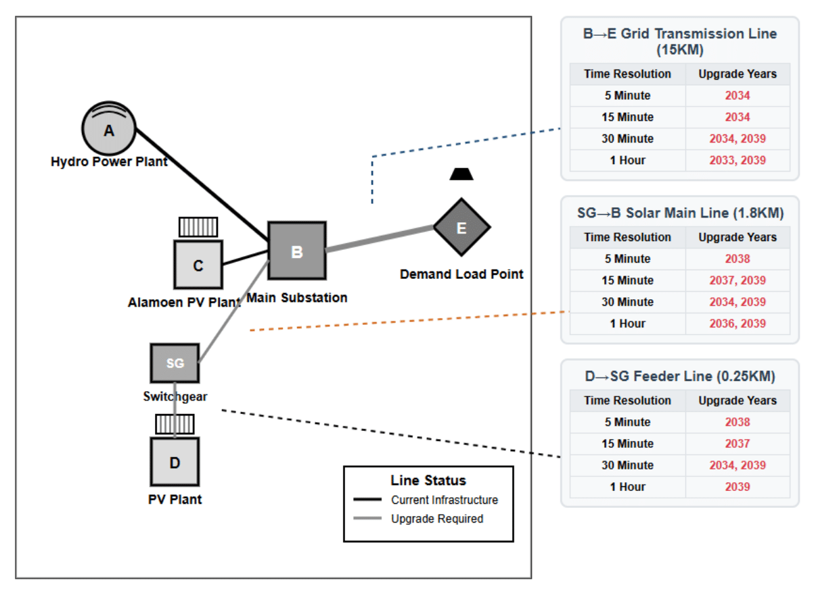
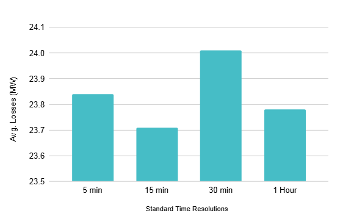
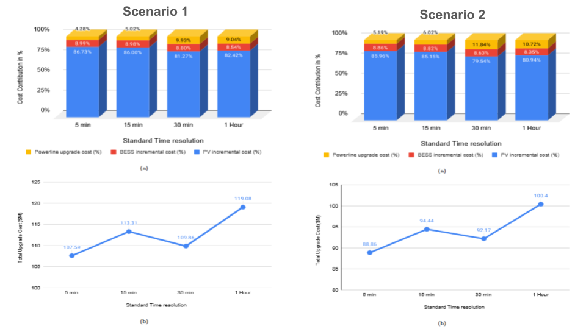
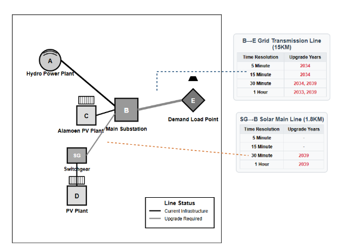
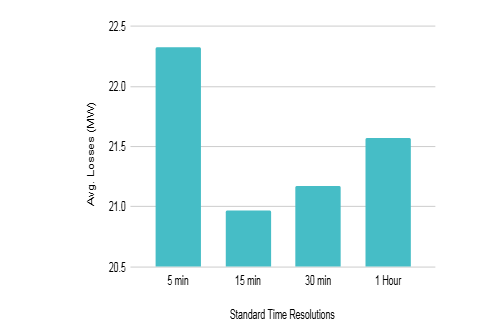
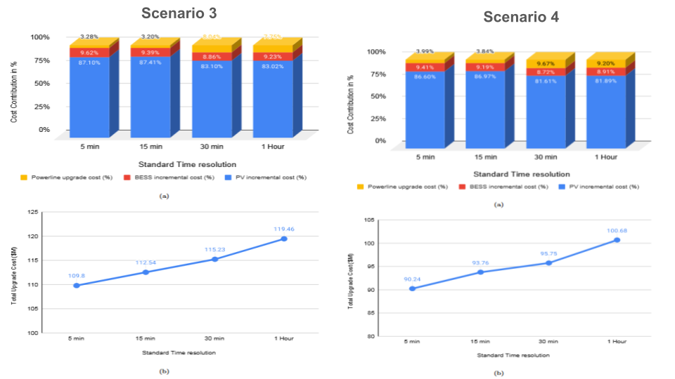
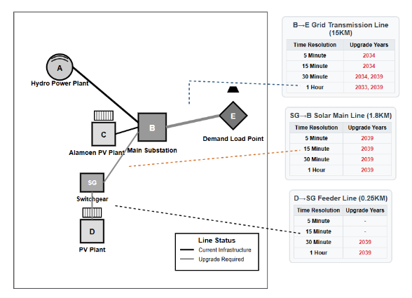
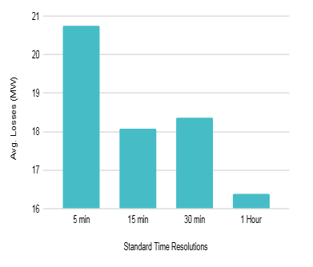

# Project Title

 Multi-scale-and-multi-stage-capacity-expansion-planning-for-Solar-coupled-battery-storage-system

# Project Description

This repository presents the capacity expansion model for a strategically integrated renewable energy system in Hjartdal municipality, located in Upper Telemark within **Vestfold og Telemark county, Norway**
The model validation is conducted across five distinct scenarios designed to comprehensively evaluate system performance under varying operational and technological conditions shown in the Table.

| **Scenario No** | **Scenarios**                      |
|-----------------|------------------------------------|
| 1               | Business-as-usual (BAU)            |
| 2               | Technology Maturity                |
| 3               | PV and BESS degradation            |
| 4               | Degradation and Tech Maturity      |
| 5               | Energy secure                      |

The validation framework uses five progressively complex scenarios:

**BAU** – Baseline system performance without tech advances or degradation.
**Technology Maturity** – Assesses the impact of improved renewable technologies and cost reductions.
**Degradation** – Evaluates effects of PV and BESS performance degradation over time.
**Degradation and Tech Maturity** – Considers both degradation and tech maturity for realistic long-term projections.
**Energy Security** – Adds redundancy constraints to test system resilience under partial outages.

This approach enables comprehensive validation of the optimization model and highlights the impact of each factor on system planning.

# Capacity Expansion Model

This Model allows you to generate Single Line Diagrams (SLDs) of a grid network and provide 15 years of capacity expansion planning, considering various electrical power system configurations &load demand, Power Security, PV & Battery degradation and Tech-Maturity.

## Project Structure

```
├── CSS/                    # Folder containing all models of different scenarios
│   ├── Scenario_1_BAU.ipynb
│   ├── Scenario_2_Technology_Maturity.ipynb
│   ├── Scenario_3_PV_BESS_degradation.ipynb
│   ├── Scenario_4_Degradation_Tech_Maturity.ipynb
│   └── Scenario_5_Energy_secure.ipynb
└── analysis/               # Folder containing analysis result charts and findings
```
## Network Overview


The electrical power network centers around the **Alamoen substation (B)** and consists of five primary nodes interconnected through transmission lines of varying voltage levels and distances.

- A **120 MW hydropower facility (A)** in the Hjartdøla area connects to Alamoen via a 10 km 2×132 kV line.
- A **103 MW solar PV plant (C)** under construction connects directly to Alamoen via a 132 kV line.
- Power is distributed from Alamoen to the **Reskjem substation (E)** via a 15 km 132 kV transmission line.
- A proposed **150 MW solar power plant (D)** is planned in Hjartdal, 1.8 km from Alamoen, connected via a 0.25 km feeder line and 33 kV switchgear.

## Data Standardisation
The model is driven by the different resolution time-series datasets corresponding to three generation units and the overall network demand, as shown in the table below.

| **Sl No** | **Datasets**            | **Time Resolution** |
|-----------|--------------------------|----------------------|
| 1         | Load Demand              | 10 min               |
| 2         | Solar PV generation      | 15 min               |
| 3         | Hydro generation         | 5 min                |
| 4         | Alamoen PV generation    | 60 min               |


The dataset comprises a 15-year temporal span, incorporating both historical operational data and forecasted projections from 2025 to 2039.

🕒 Multi-Scale Data Standardization
The model standardizes datasets with varying time resolutions into four uniform intervals: 5-min, 15-min, 30-min, and 1-hour, ensuring consistency for performance evaluation across temporal scales.

⚡ Demand vs Generation Insight (2025–2039)
From 2025 to 2039, demand grows from 150.8 MW to 293.0 MW, while total generation from PV, hydro, and Alamoen PV remains static at ~163.8 MW, highlighting a significant energy gap shown figure below.


## Model Validation in different scenarios

**Scenario 1 (business as usual) and 2 (technology maturity)**



Grid Transmission Line: Consistent upgrade need in 2033–2034, with secondary upgrades by 2039 (30-min & 1-hr resolutions).
Solar Main Line: Highly resolution-sensitive—upgrades range from 2034 to 2039, occurring earlier in lower-resolution models.
Feeder Line: Most variable—single upgrade in 2038 (5-min) vs. multiple upgrades from 2034–2039 (30-min); 1-hr shows only 2039.



This figure shows 1.3% variation shows that time resolution impacts loss estimation in power system modelling.



The cost comparison figure illustrated that thee technology maturity scenario demonstrates significant economic optimization potential through advanced renewable energy technologies and improved system efficiency parameters.

**Scenario 3 (PV and BESS degradation) and 4 (Degradation and Tech. Maturity)**
This analysis highlights how PV and BESS degradation (Scenarios 3 & 4) affect upgrade scheduling in Hjartdal's distribution network. Temporal resolution has a significant impact, with upgrade timings shifting based on the data granularity used in the analysis. This underscores the importance of accurate time resolution in long-term grid planning under component degradation. show below figure




The below power losses figure demonstrates that loss computation exhibits sensitivity to sampling frequency, with notable variations across standard aggregation intervals.



Cost contribution for upgration is showing in below figure



**Scenario 5 (Tech Maturity)**

The below figure illustrates the grid Transmission Line: Requires upgrades across all resolutions—2034 for high-resolution (5-min to 30-min) and 2033 for 1-hour. Solar Main Line & Feeder Line: Upgrades begin in 2039 across all time resolutions, driven by energy security constraints, not data granularity.
This highlights the system's need for resilience-focused reinforcement under critical conditions.



The chart in Figure shows a clear pattern where longer time resolutions generally result in lower average losses




| **Metric**                    | **5 min** | **15 min** | **30 min** | **1 h** |
| ----------------------------- | --------- | ---------- | ---------- | ------- |
| Final PV Capacity (MW)        | 150.0     | 150.0      | 150.0      | 150.0   |
| Final BESS Capacity (MW)      | 52.0      | 62.2       | 63.1       | 70.2    |
| Power Generation Reduced (MW) | 46.6      | 46.6       | 46.6       | 46.6    |
| Unmet Demand (MW)             | 14.1      | 2.7        | 4.1        | 3.0     |
| Shortfall Cover Percentage    | 69.70%    | **94.20%** | 91.20%     | 93.60%  |

above table shows how effectively PV and BESS cover a 46.6 MW hydropower shortfall under the energy-secure scenario: 5-min resolution covers only 69.7% of the shortfall, leading to higher unmet demand. Coarser resolutions (15-min, 30-min, 1-hour) achieve 94.2%, 91.2%, and 93.6% coverage respectively.

The 15-minute resolution offers the best performance, balancing temporal accuracy and system adequacy.

## Findings

• The model shows that a 15-minute resolution results in the lowest average losses under the BAU scenario, even with technological maturity constraints. When degradation is included, losses gradually decrease with coarser resolutions.
• When the hydropower generation is reduced by half, the model maintains energy security but becomes highly sensitive to time resolution, with average power losses decreasing by nearly 21% from 5-minute to 1-hour intervals.
• Across all scenarios, the model demonstrates that higher temporal resolution datasets (e.g., 5-minute intervals) require fewer transmission cable upgrades compared to lower resolution datasets
• Considering the power cable upgrade requirements, the model indicates a 55.56% reduction in necessary cable upgrades compared to the Business-as-Usual (BAU) scenario when degradation constraints are incorporated. However, under energy security conditions, the model requires 33.33% fewer cable upgrades relative to BAU.
• Under an energy-secure scenario in 2039, the model shows that coarser time resolutions significantly improve the system’s ability to cover a 46.6 MW hydropower shortfall, with the 15-minute resolution achieving the highest shortfall coverage at 94.2%, indicating an optimal balance between accuracy and system adequacy.
