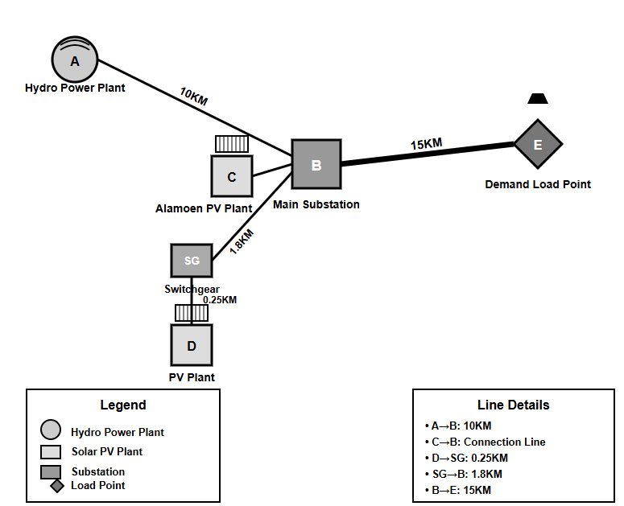
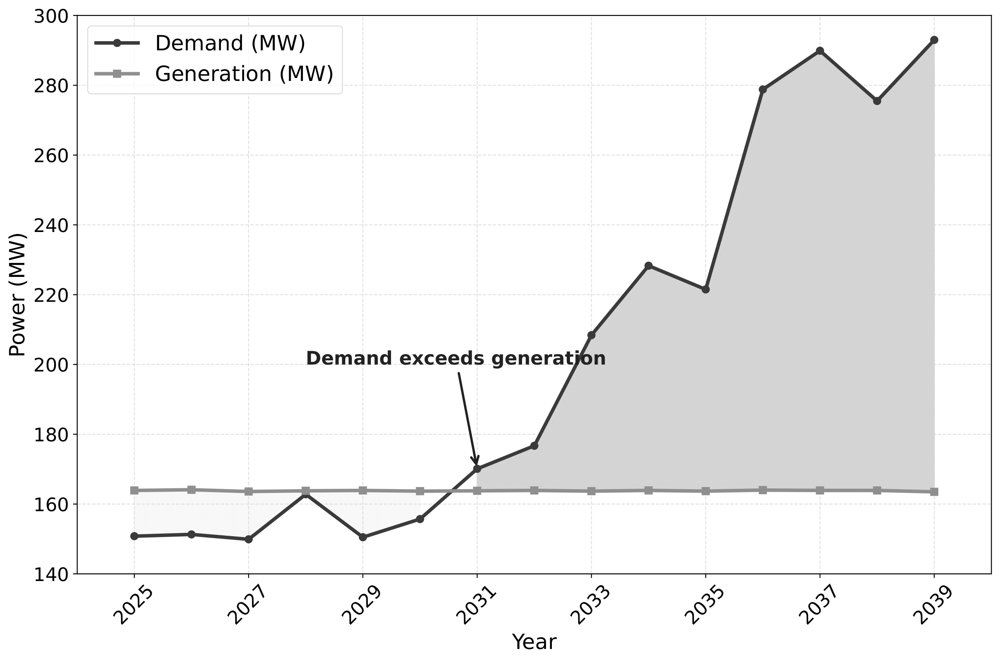

# Project Title

 Multi-scale-and-multi-stage-capacity-expansion-planning-for-Solar-coupled-battery-storage-system

# Project Description

This repository presents the capacity expansion model for a strategically integrated renewable energy system in Hjartdal municipality, located in Upper Telemark within **Vestfold og Telemark county, Norway**
The model validation is conducted across five distinct scenarios designed to comprehensively evaluate system performance under varying operational and technological conditions shown in the Table.

| **Scenario No** | **Scenarios**                      |
|-----------------|------------------------------------|
| 1               | Business-as-usual (BAU)            |
| 2               | Technology Maturity                |
| 3               | PV and BESS degradation            |
| 4               | Degradation and Tech Maturity      |
| 5               | Energy secure                      |

The validation framework uses five progressively complex scenarios:

**BAU** – Baseline system performance without tech advances or degradation.
**Technology Maturity** – Assesses the impact of improved renewable technologies and cost reductions.
**Degradation** – Evaluates effects of PV and BESS performance degradation over time.
**Degradation and Tech Maturity** – Considers both degradation and tech maturity for realistic long-term projections.
**Energy Security** – Adds redundancy constraints to test system resilience under partial outages.

This approach enables comprehensive validation of the optimization model and highlights the impact of each factor on system planning.

# Capacity Expansion Model

This Model allows you to generate Single Line Diagrams (SLDs) of a grid network and provide 15 years of capacity expansion planning, considering various electrical power system configurations &load demand, Power Security, PV & Battery degradation and Tech-Maturity.

## Project Structure

```
├── CSS/                    # Folder containing all models of different scenarios
│   ├── Scenario_1_BAU.ipynb
│   ├── Scenario_2_Technology_Maturity.ipynb
│   ├── Scenario_3_PV_BESS_degradation.ipynb
│   ├── Scenario_4_Degradation_Tech_Maturity.ipynb
│   └── Scenario_5_Energy_secure.ipynb
└── analysis/               # Folder containing analysis result charts and findings
```
## Network Overview



The electrical power network centers around the **Alamoen substation (B)** and consists of five primary nodes interconnected through transmission lines of varying voltage levels and distances.

- A **120 MW hydropower facility (A)** in the Hjartdøla area connects to Alamoen via a 10 km 2×132 kV line.
- A **103 MW solar PV plant (C)** under construction connects directly to Alamoen via a 132 kV line.
- Power is distributed from Alamoen to the **Reskjem substation (E)** via a 15 km 132 kV transmission line.
- A proposed **150 MW solar power plant (D)** is planned in Hjartdal, 1.8 km from Alamoen, connected via a 0.25 km feeder line and 33 kV switchgear.

## Data Standardisation
The model is driven by the different resolution time-series datasets corresponding to three generation units and the overall network demand, as shown in the table below.

| **Sl No** | **Datasets**            | **Time Resolution** |
|-----------|--------------------------|----------------------|
| 1         | Load Demand              | 10 min               |
| 2         | Solar PV generation      | 15 min               |
| 3         | Hydro generation         | 5 min                |
| 4         | Alamoen PV generation    | 60 min               |
The dataset comprises a 15-year temporal span, incorporating both historical operational data and forecasted projections from 2025 to 2039.

🕒 Multi-Scale Data Standardization
The model standardizes datasets with varying time resolutions into four uniform intervals: 5-min, 15-min, 30-min, and 1-hour, ensuring consistency for performance evaluation across temporal scales.

⚡ Demand vs Generation Insight (2025–2039)
From 2025 to 2039, demand grows from 150.8 MW to 293.0 MW, while total generation from PV, hydro, and Alamoen PV remains static at ~163.8 MW, highlighting a significant energy gap show figure below.


## Model Validation in different scenarios

**Scenario 1 (business as usual) and 2 (technology maturity)**


